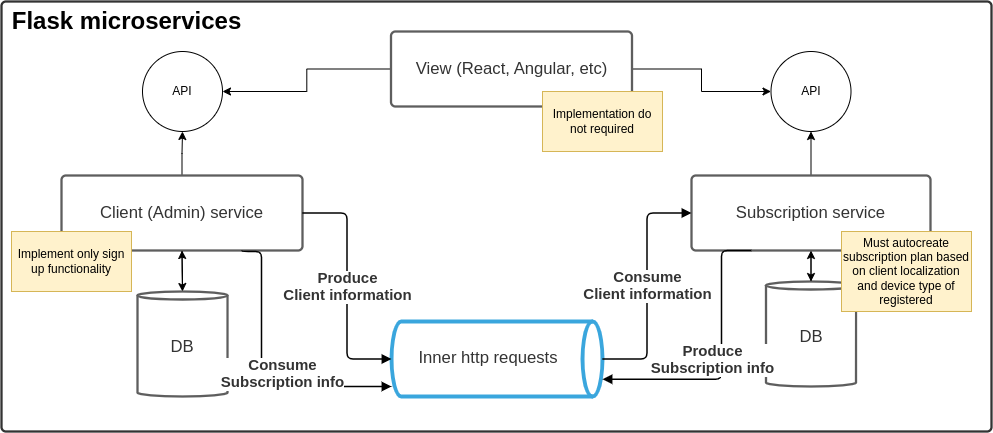
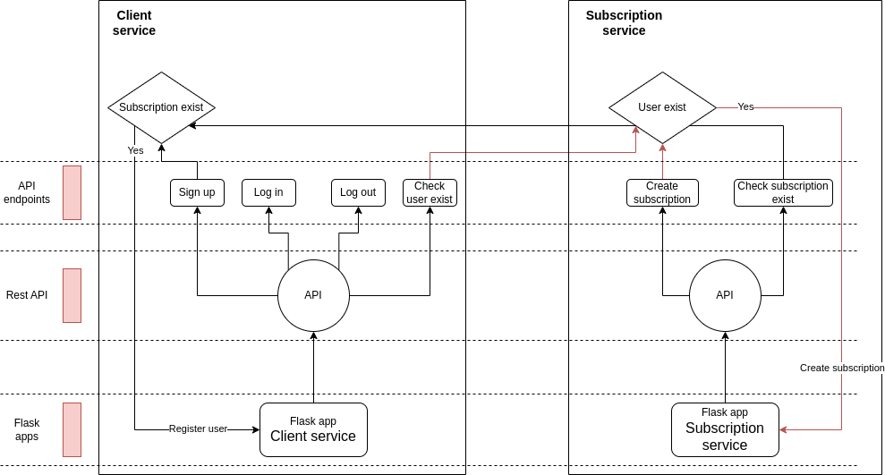

# django-simple-microservices 10web task


***
10Web company gave a task. The task would be implemented by microservices by Flask engine.
## Task Description

Imagine a platform which provides news feed service. The task is to design an architecture that
should include at least two services: a Client Service, Subscription Service and support the
following functionality.
1. Client Service: This service should handle client-related operations such as sign up,
login, and profile management. It should have its own database to store client
information. (implement only client's sign up)
2. Subscription Service: This service should manage all subscription-related operations. It
should offer multiple subscription plans, with pricing based on the client's region and
device type (e.g., USA, iOS). It should also include a subscribe functionality
implemented as an API route. The subscription plan should be chosen automatically on
clients signup based on the client's region and device type. This service should have its
own database to store subscription plan information and client subscriptions. (Implement
only choosing right subscription part, use 3 predefined plans)
3. Transaction Logic: The architecture should ensure that every client is associated with a
subscription plan and vice versa. In other words, there should not exist a client without a
subscription or a subscription without a client.
4. Front End is not required.
***

# Microservices design
### High level design

### Algorithmic level design

***

# Project description
```
├── .github
│   └── workflows
│       ├── code_quality.yml
│       └── tests.yml
├── .gitignore
├── helpers
│   ├── client.py
│   ├── __init__.py
│   └── subscription.py
├── microservices
│   ├── client.py
│   ├── __init__.py
│   └── subscription.py
├── models
│   ├── client.py
│   ├── __init__.py
│   └── subscription.py
├── pylintrc
├── README.md
├── requirements.txt
└── tests
    ├── client_test.py
    ├── helpers_test.py
    ├── __init__.py
    └── subscription_test.py
```
***
### Steps for running service

***
## Installation:
### Local Setup
If you have cloned this repository and created a virtual environment for it. You can install all the dependencies by running:
``` bash
pip3 install -r requirements.txt
```

***
# Usage
## Methodology
Running Client and Subscription services. Client service responsible for Client related operations such as registering, 
logging in, etc. Each service provides independent Flask restAPI which allow us to register User and create Subscriptions
manually. There is pre-defined **3** subscription plans (which is selecting automatically per registered user if it is possible).
**If registration was not finished successfully or subscription plan was not able to assigned - Client and subscription deleting
automatically to avoid to have Client without subscription and Subscription without Client**.

## Running services
Run first (Client service)
```bash
    python -m flask --app microservices/client run
```
Run second (Subscription service)
```bash
    python -m flask --app microservices/subscription run
```
## API endpoints
Import ```10Task_microservice_endpoints.postman_collection.json``` file into postman and investigate endpoints

***
## Contributing guidelines
Thank you for following them!

### Branching strategy
Nothing new, nothing fancy:
* "Main" Branch:This is the primary branch that represents the production-ready version of the codebase. Developers 
should aim to keep this branch stable, and it should only contain code that has been fully tested and is ready
for release.

* "Development" Branch:This branch is used to integrate new code changes and features that are not yet production-ready.
Developers work on this branch to implement new functionality, fix bugs, and make improvements to the codebase. 
Once the changes are tested and validated, they are merged into the main branch for release.

* "Features" Branch:Feature branches are used to develop new features or major changes to the codebase. These 
branches are created off the development branch and allow developers to work independently on specific features 
without interfering with the development of other features.

* "Hotfixes" Branch:Hotfix branches are used to quickly address critical issues or bugs in the codebase that require
immediate attention. These branches are created off the main branch and allow developers to fix issues without
disrupting the development of new features on the development branch. Once the fix is complete, the hotfix branch is
merged back into the main branch.

### New features or refactorings
- Create a branch from development branch.
- Describe the changes you made and why you made them. If there is a JIRA task associated, please  write its reference.
- Implement your changes
- Ensure that the code is properly formatted and passes all existing tests. Create new tests for new methods or classes.
- Make sure to update the documentation if necessary
- Ask for a merge request to the development branch as soon as possible to avoid differences overlapping.

### CI/CD
#### Coverage
In this repo we are using coverage to check the code coverage of the tests. You can test it by running
``` bash
 coverage run -m pytest 
```
Then you can visualize the coverage report with:
``` bash
 coverage report
```
The highest the coverage the better! Also, make sure that every file is being covered.
Personally, if you are using Pycharm-Pro I recommend use the function "Run Python tests in tests with coverage" as it 
will allow you to see which lines are not under coverage.

## Future Work
- Add unit and integration tests (by mocking requests and databases)
- Improve annotations and responsibility splitting based on SOLID principles